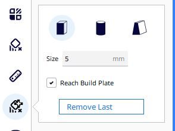
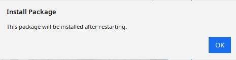
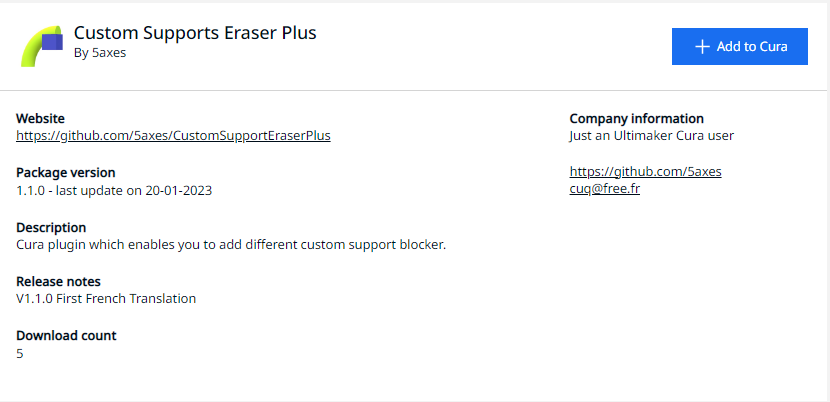
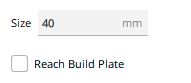
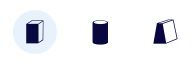

# Custom Supports Eraser Plus Plugin for Cura

Cura plugin which enables you to add custom different support blocker types. It was originaly based on the ***Support Eraser plugin*** code of *Ultimaker BV*. But instead of creating only a fixed sized cube **"anti_overhang_mesh"**, this plugin offer you the possibility to define a custom sized shape element.

Source code on Github : [https://github.com/Ultimaker/Cura/tree/master/plugins/SupportEraser](https://github.com/Ultimaker/Cura/tree/master/plugins/SupportEraser)

This plugin offer now much more possibilities :
----

- Possibility to define squarred  / cylindrical / Custom Support
- Possibility to define the support size
- Visualisation of the support eraser on the total height

The initial version was tested on Cura 4.8 but last release tested from 4.8 to 5.3

## Installation

### Manual Installation

Download the latest release from this [repository](https://github.com/5axes/CustomSupportEraserPlus/releases)

Drop the curapackage according to your Cura release in the 3d viewport in Cura as if you were opening a 3d model. You will then be prompted to restart Cura.

### Automatic installation for Cura 4.X and Cura 5.X

First, make sure your Cura version is 4.8 or newer. This plugin is now avalaible in the Cura marketplace. So you can install it automaticaly from this place:

[Custom Supports Eraser Plus on Ultimaker Market place](https://marketplace.ultimaker.com/app/cura/plugins/5axes/CustomSupportEraserPlus)

## How to use

* Load a model in Cura and select it

* Click on the "Custom Supports Eraser plus" button on the left toolbar
* With the 3 buttons in the plugin windows, it's possible to switch the geometry between a cube, a cylinder or a custom support.
* Change the value for the support *Size* in numeric input field in the tool panel if necessary

Select the type of support to create with the buttons in the support plugin interface :

- Click anywhere on the model to place support eraser there
* The length of the support is automaticaly set from the pick point to the construction plate if the option "Reach Build Plate" is active.

- **Clicking existing support eraser deletes it**

- **Clicking existing support eraser + Ctrl** switch automaticaly to the Translate Tool to modify the position of the support.

- **Clicking existing support eraser + Alt** this shorcut allow to add a support on a existing support.

>Note: it's easier to add/remove supports blocker when you are in "Solid View" mode

## Modifications

- Version 1.00 : Initial Release
